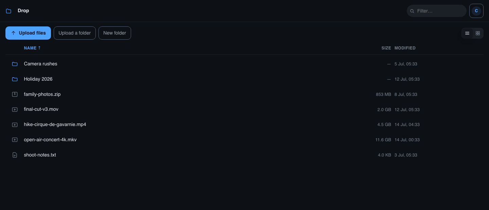
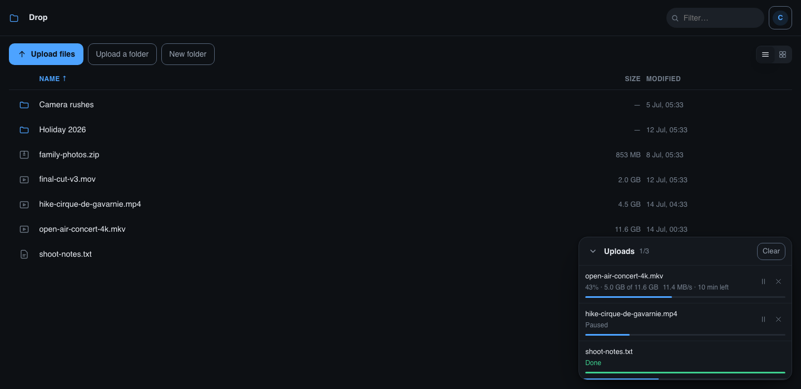
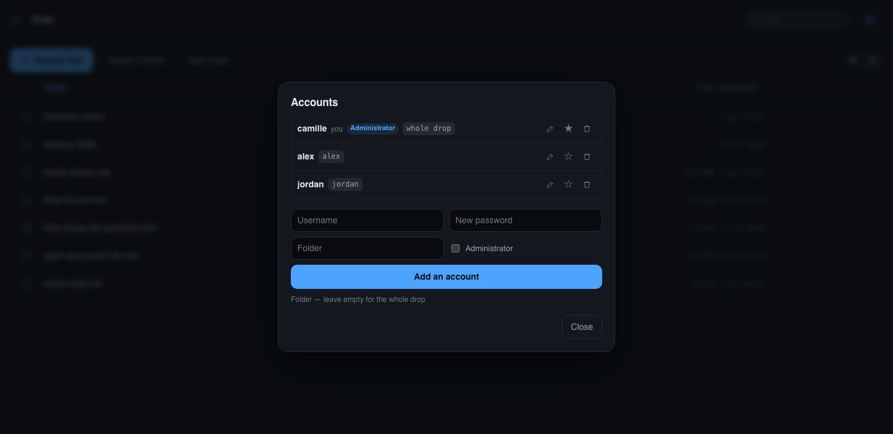
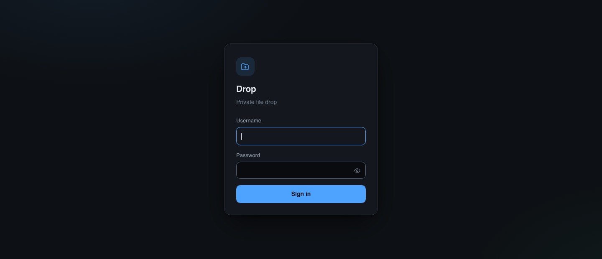
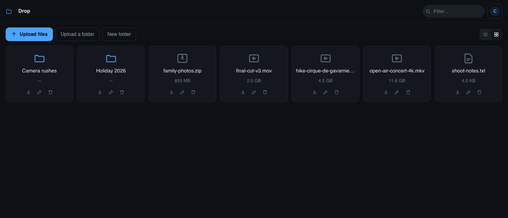
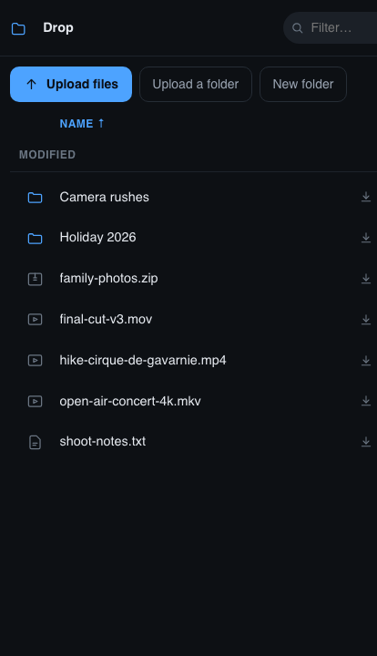
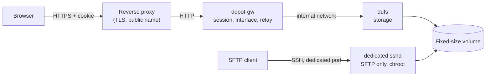
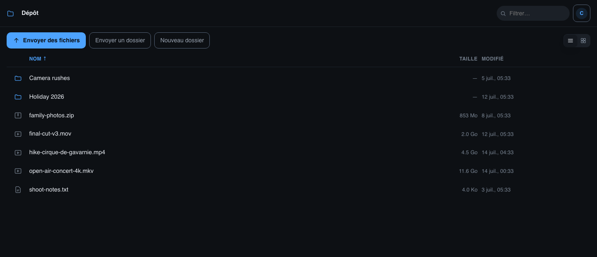

# Drop

A self-hosted file drop: a web page for sending large files from a browser, and
SFTP access to **the same folder**. Built to give someone a place to drop videos
without making them install anything, and without handing your files to a third
party.

Storage is [dufs](https://github.com/sigoden/dufs). This repository adds the two
missing pieces: session authentication with a real sign-in page, and chunked
uploads that survive a proxy which caps request size.



<table>
  <tr>
    <td></td>
  </tr>
  <tr>
    <td></td>
  </tr>
  <tr>
    <td></td>
  </tr>
</table>

<table>
  <tr>
    <td width="72%"></td>
    <td></td>
  </tr>
</table>

## Why this is not just "dufs behind a proxy"

Two constraints shaped the design. Each one bites if you ignore it.

**dufs only speaks HTTP Basic.** The browser then shows its own credential
dialog, which no stylesheet can replace. Putting a sign-in page in front therefore
means the browser must never talk to dufs directly. That is what `depot-gw` does:
it owns the session, serves the interface, and relays the storage calls. The
cookie it sets also covers downloads and video streaming — something an
`Authorization` header cannot do from a plain `<a download>` or `<video src>`.

**Cloudflare rejects any request body over 100MB** (Free and Pro; 200MB on
Business, 500MB on Enterprise). A tunnel or a proxied record cannot opt out.
Sending a whole file in one request therefore condemns any real video to a `413`.
The interface slices at 32MB: the first slice as `PUT`, the rest as `PATCH` with
the `X-Update-Range: append` header that dufs stitches back together. Welcome side
effect — an interruption only costs the slice in flight, and pausing is free.

## Architecture



Only `depot-gw` is published. dufs listens on the stack's internal network alone,
and the sshd instance is separate from the system's so the root login on port 22 is
never exposed.

## Features

- Sign-in page, signed cookie session, sign-out
- Accounts managed from the interface: create, delete, reset a password, promote
- **One folder per account, or the whole drop** — chosen per account
- Guests change their own password, so the owner is not the help desk
- Drag and drop anywhere on the page, **whole folders included**
- Chunked uploads, **resume after an interruption**, pause, cancel, retry
- Per-file progress: percentage, rate, time left
- List or grid, breadcrumb, filter, column sorting
- Inline preview: video, image, audio, text, PDF
- New folder, rename, delete — through our own dialogs, no browser windows
- Volume usage indicator
- English and French interface, picked from the browser or pinned in the config
- Dark and light theme following the system, usable by thumb on a phone

## Setup

### 1. A fixed-size volume

So that a massive drop cannot fill the host disk, the served folder lives in a
bounded image:

```bash
sudo ./scripts/create-volume.sh /srv/depot.img /srv/depot 100G
```

### 2. The SFTP account and instance

See [`sftp/README.md`](sftp/README.md). The part not to miss: it is a **second**
sshd instance, with its own configuration, on its own port. Adding SFTP accounts
to the sshd on port 22 would mean publicly exposing the port that also serves the
root login.

### 3. Both configuration files

There are **two**, one per tier. They are in `.gitignore`: create them from the
templates.

```bash
cp dufs.example.yaml           config.yaml          # storage
cp gateway/config.example.json gateway/config.json  # gateway
```

Forgetting `config.yaml` is the easiest mistake: Docker then creates a *directory*
by that name and the storage refuses to start with `Is a directory (os error 21)`.

### 4. Data path and identity

The service writes into the folder shared with SFTP, and must do so as the same
account, or files dropped through one route cannot be managed through the other.
That lives in a `.env` next to `docker-compose.yml`:

```ini
DEPOT_DATA=/srv/depot/guest/upload   # the served folder, the SFTP chroot
DEPOT_UID=1001                       # SFTP account id: id -u guest
DEPOT_GID=1001                       # id -g guest
DEPOT_BIND=127.0.0.1                 # publish address, left to the proxy
```

| Variable | Default | Purpose |
| --- | --- | --- |
| `DEPOT_DATA` | `/srv/depot/upload` | served folder, shared with SFTP |
| `DEPOT_UID` / `DEPOT_GID` | `1001` | account the files are written as |
| `DEPOT_BIND` | `127.0.0.1` | published listen address, port 8099 |

### 5. The first account

Only the first one is created by hand; every account after it is managed from the
interface.

```bash
docker compose build
docker run --rm depot-gw:1 -hash 'the-password'
```

Put the resulting hash into `gateway/config.json` as an `admin: true` account, and
**replace the `secret`** with a random value:

```bash
openssl rand -base64 48
```

The template secret ships in this repository: leaving it in place would let anyone
forge a valid session cookie. The service refuses to start until it is changed.

```bash
docker compose up -d
```

Check that both tiers hold:

```bash
docker compose ps
docker compose logs depot-storage    # should announce its listener, not an error
curl -si localhost:8099/ | head -1   # 200, and no WWW-Authenticate header
```

### 6. Behind a reverse proxy

Two settings are not optional if large files are to get through:

```nginx
client_max_body_size 0;        # otherwise the proxy's own limit truncates slices
proxy_request_buffering off;   # otherwise the proxy spools everything to its disk first
proxy_read_timeout 3600s;
proxy_send_timeout 3600s;
```

`proxy_request_buffering off` is the easiest to forget and the most expensive:
without it, a 20GB upload is written out in full on the disk of whatever machine
hosts the proxy.

## Accounts

`users[]` in the config is a **seed**, not the live list. On first start it is
copied into `users_file` — `/var/lib/depot-gw/users.json` by default, which
`docker-compose.yml` maps to `gateway/state/` — and everything after that happens
in the interface. Accounts are deliberately kept out of `config.json`: they are
the only state this program rewrites, so a bug in that path cannot take the
signing secret with it.

> The accounts file **must** sit on a mount. Left inside the container it works
> perfectly until the next `docker compose build`, which silently takes every
> account created since with it.

Each account carries a **folder**. Empty means the whole drop; set, the account is
confined to that subfolder and neither sees nor writes anywhere else. Both kinds
can coexist — the household member gets the whole drop, each guest gets a corner.

The confinement is enforced in the gateway on **every request**, not by hiding
buttons: reads, writes, deletes and moves are all checked, `..` included. The
interface is told where its root is only so it does not offer a door that would
be refused anyway. To check that on your own install:

```bash
BASE=http://127.0.0.1:8099 ADMIN=me ADMIN_PW=... ./scripts/test-accounts.sh
```

It creates `test-*` accounts and deletes them afterwards, so point it at a
throwaway install rather than one in service.

Changing a password invalidates every session that account had open, anywhere —
each account carries a counter that rides inside the signed cookie. Deleting an
account has the same effect immediately.

## Updating

```bash
git pull
docker compose build
docker compose up -d
```

The dufs image is pinned in `docker-compose.yml`. It can be moved freely: the
interface is served by the gateway, not by dufs, so there is nothing to carry over
on the storage side.

## Configuration

| Key | Purpose |
| --- | --- |
| `listen` | internal listen address (`:5100`) |
| `upstream` | dufs URL (`http://depot-storage:5000`) |
| `upstream_auth` | `user:password` if dufs keeps accounts, otherwise empty |
| `quota_path` | path whose usage is reported |
| `session_ttl_hours` | cookie lifetime |
| `secret` | cookie signing key, 32 characters minimum |
| `title` | displayed name |
| `lang` | `en` or `fr`; empty follows each browser |
| `users_file` | where accounts live; must be on a mount |
| `users[]` | seed only: `name`, `hash` (PBKDF2), `admin`, `root` |

`gateway/config.json` holds a signing key and password hashes: it is in
`.gitignore` and has no business in a Git repository.

## Translations

Every visible string lives in the `I18N` dictionary at the top of
`gateway/web/app.js`, and the static markup carries `data-i18n` attributes. Adding
a language means adding one object to that dictionary — no build step, no
dependency. The server answers with stable error codes (`bad_credentials`,
`throttled`, `session_expired`) precisely so the wording stays in that one place.



## Security

- Passwords with PBKDF2-HMAC-SHA256, 210,000 iterations, per-account salt
- Session cookie signed with HMAC-SHA256, `HttpOnly`, `SameSite=Lax`, `Secure` as
  soon as the request arrives over HTTPS
- Constant response time between an unknown account and a wrong password
- Progressive per-IP lockout after 5 failures: 1, 2, 4… up to 32 minutes
- Every write requires an `X-Depot` header, which a cross-site form cannot set
- Paths are normalised before they reach the storage, and every request is
  checked against the account's folder — including the destination of a move
- A password change, or a deletion, drops that account's open sessions at once
- No external dependency on either side: no CDN, no third-party module, so there
  is nothing to track beyond the standard library

## Credits

Storage is [dufs](https://github.com/sigoden/dufs) by sigoden, under MIT or
Apache-2.0. Its `PATCH` + `X-Update-Range: append` API is what makes chunked
uploading possible without changing anything on its side.

This repository is under the [MIT licence](LICENSE).
