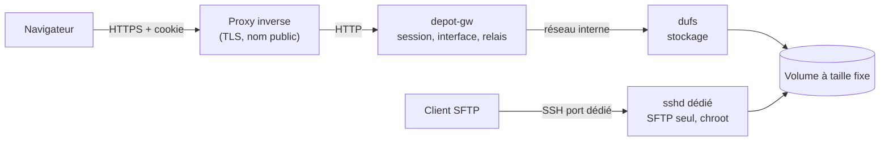

# Dépôt

Un espace de dépôt de fichiers auto-hébergé : une page web pour envoyer des
fichiers volumineux depuis un navigateur, et un accès SFTP sur **le même
dossier**. Pensé pour donner à quelqu'un un endroit où déposer des vidéos sans
lui faire installer quoi que ce soit, et sans confier ses fichiers à un service
tiers.

Le stockage est assuré par [dufs](https://github.com/sigoden/dufs). Ce dépôt
apporte les deux morceaux qui manquaient : une authentification par session avec
une vraie page de connexion, et un envoi découpé en tranches capable de traverser
un proxy qui plafonne la taille des requêtes.

## Pourquoi ce n'est pas juste « dufs derrière un proxy »

Deux contraintes ont dicté l'architecture. Chacune se paie si on l'ignore.

**dufs ne sait faire que du HTTP Basic.** Le navigateur affiche alors sa propre
fenêtre d'identifiants, qu'aucune feuille de style ne peut remplacer. Mettre une
page de connexion devant suppose donc que le navigateur ne parle jamais
directement à dufs. C'est le rôle de `depot-gw` : il possède la session, sert
l'interface, et relaie les appels de stockage. Le cookie qu'il pose vaut aussi
pour les téléchargements et la lecture vidéo — ce qu'un en-tête `Authorization`
ne peut pas faire depuis un simple `<a download>` ou `<video src>`.

**Cloudflare refuse tout corps de requête au-delà de 100 Mo** (offres Free et
Pro ; 200 Mo en Business, 500 Mo en Enterprise). Un tunnel ou un enregistrement
proxifié n'y échappe pas. Envoyer un fichier entier en une requête condamne donc
toute vidéo un peu sérieuse à un `413`. L'interface découpe en tranches de 32 Mo :
la première en `PUT`, les suivantes en `PATCH` avec l'en-tête
`X-Update-Range: append` que dufs sait recoller. Effet de bord bienvenu, une
coupure ne coûte que la tranche en cours, et la pause devient gratuite.

## Architecture



Seul `depot-gw` est publié. dufs n'écoute que sur le réseau interne du stack, et
l'instance sshd est séparée de celle du système pour ne jamais exposer la
connexion root du port 22.

## Fonctions

- Page de connexion, session par cookie signé, déconnexion
- Glisser-déposer sur toute la page, y compris des **dossiers entiers**
- Envoi par tranches, **reprise après coupure**, pause, annulation, relance
- Progression par fichier : pourcentage, débit, temps restant
- Liste ou grille, fil d'Ariane, filtre, tri par colonnes
- Aperçu en place : vidéo, image, audio, texte, PDF
- Nouveau dossier, renommage, suppression — avec des dialogues maison, aucune
  fenêtre du navigateur
- Indicateur de remplissage du volume
- Thème sombre et clair selon le système, utilisable au doigt sur téléphone

## Mise en place

### 1. Un volume à taille fixe

Pour qu'un dépôt massif ne puisse pas remplir le disque de la machine, le dossier
servi vit dans une image de taille bornée :

```bash
sudo ./scripts/creer-volume.sh /srv/depot.img /srv/depot 100G
```

### 2. Le compte et l'instance SFTP

Voir [`sftp/README.md`](sftp/README.md). Le point à ne pas manquer : c'est une
**seconde** instance sshd, avec sa propre configuration, sur son propre port.
Ajouter des comptes SFTP au sshd du port 22 obligerait à exposer publiquement le
port qui sert aussi la connexion root.

### 3. Le service web

```bash
cp gateway/config.example.json gateway/config.json
docker compose build
docker compose run --rm --no-deps --entrypoint depot-gw depot-web -hash 'le-mot-de-passe'
```

Reporter l'empreinte obtenue dans `gateway/config.json`, y mettre un `secret`
aléatoire d'au moins 32 caractères (`openssl rand -base64 48`), puis :

```bash
docker compose up -d
```

Le service écoute sur `${DEPOT_BIND}:8099`, par défaut `127.0.0.1`. Poser un
proxy inverse devant pour le TLS et le nom public.

### 4. Derrière un proxy inverse

Deux réglages ne sont pas optionnels si des fichiers volumineux doivent passer :

```nginx
client_max_body_size 0;        # sinon la limite du proxy tronque les tranches
proxy_request_buffering off;   # sinon le proxy recopie tout sur son disque avant de relayer
proxy_read_timeout 3600s;
proxy_send_timeout 3600s;
```

`proxy_request_buffering off` est le plus facile à oublier et le plus coûteux :
sans lui, un envoi de 20 Go est d'abord écrit en entier sur le disque de la
machine qui héberge le proxy.

## Configuration

| Clé | Rôle |
| --- | --- |
| `listen` | adresse d'écoute interne (`:5100`) |
| `upstream` | URL de dufs (`http://depot-stockage:5000`) |
| `upstream_auth` | `utilisateur:motdepasse` si dufs garde ses comptes, sinon vide |
| `quota_path` | chemin dont on lit le remplissage |
| `session_ttl_hours` | durée de vie du cookie |
| `secret` | clé de signature du cookie, 32 caractères minimum |
| `title` | nom affiché |
| `users[]` | `name`, `hash` (PBKDF2), `admin` |

`gateway/config.json` contient une clé de signature et des empreintes de mots de
passe : il est dans `.gitignore` et n'a rien à faire dans un dépôt Git.

## Sécurité

- Mots de passe en PBKDF2-HMAC-SHA256, 210 000 itérations, sel par compte
- Cookie de session signé en HMAC-SHA256, `HttpOnly`, `SameSite=Lax`, `Secure`
  dès que la requête arrive en HTTPS
- Temps de réponse constant entre compte inconnu et mot de passe faux
- Blocage progressif par IP après 5 échecs : 1, 2, 4… jusqu'à 32 minutes
- Toute écriture exige un en-tête `X-Depot`, qu'un formulaire d'un autre site ne
  peut pas poser
- Les chemins sont normalisés avant d'atteindre le stockage
- Aucune dépendance externe côté serveur comme côté navigateur : pas de CDN, pas
  de module tiers, donc rien à surveiller au-delà de la bibliothèque standard

## Crédits

Le stockage est [dufs](https://github.com/sigoden/dufs) de sigoden, sous licence
MIT ou Apache-2.0. Son API `PATCH` + `X-Update-Range: append` est ce qui rend
l'envoi par tranches possible sans rien modifier chez lui.

Ce dépôt est sous [licence MIT](LICENSE).
